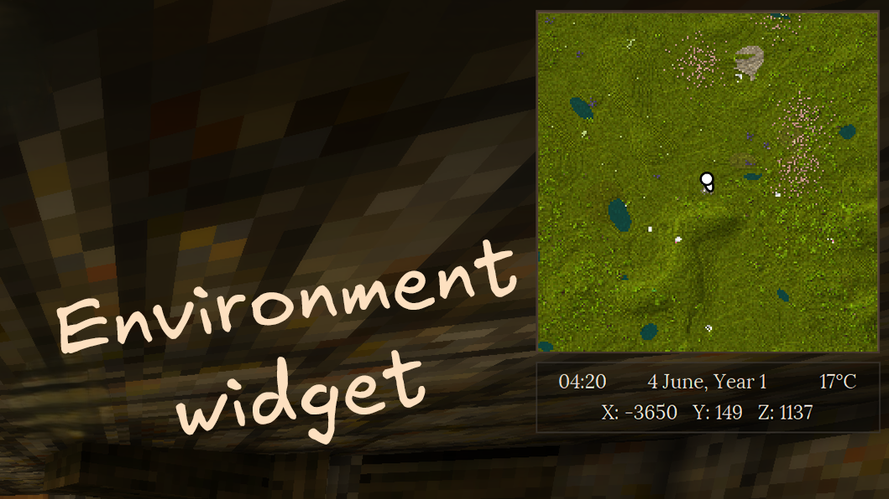
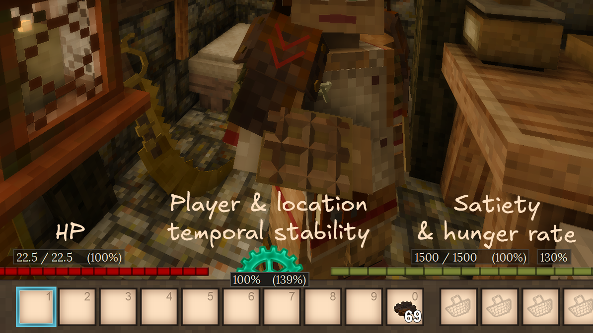
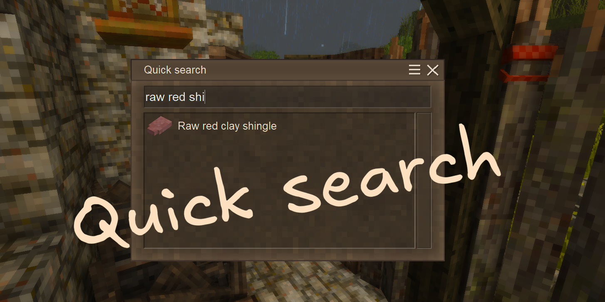

# Overview

UI Tweaks is a mod for Vintage Story that enhances the user interface by adding various quality-of-life features and visual improvements. The mod aims to provide a more intuitive and customizable UI experience for players, making it easier to navigate and interact with the game.

  

    

      &#10094;
    

    

      

        
      

      

        
      

      

        
      

      

        
      

    

    

      &#10095;
    

  

  

    
    
    
    
  

## Installation

  

    <button class="tab-button" data-tab="moddb">ModDB</button>
    <button class="tab-button" data-tab="github">GitHub</button>
  

  

    
Install UI Tweaks from the official mod repository: <a href="https://mods.vintagestory.at/uitweaks" target="_blank" rel="noopener">UI Tweaks on ModDB</a>.

  

  

    
Download the latest <code>.zip</code> from the <a href="https://github.com/BitzArt-VS/UI-Tweaks/releases" target="_blank" rel="noopener">GitHub releases page</a> and place it in your <code>Mods</code> folder.

  

Make sure to check out the [Features](02.features.md) section to see all the cool things UI Tweaks has to offer!

## Compatibility

| Status | Mod | Notes |
|:------:|-----|-------|
| 🟢 | [Status Hud Continued](https://mods.vintagestory.at/statushudcont) | Compatible. |
| 🟢 | [Calendar: Shire-reckoning](https://mods.vintagestory.at/shirereckoning) | Compatible. Month names are replaced correctly. The word "Year" in Environment Widget can be changed by editing it's config. |
| 🟡 | [Hydrate or Diedrate](https://mods.vintagestory.at/hydrateordiedrate) | Displaying thirst tooltips is not supported yet. Satiety-related tooltips should be repositioned in config to accommodate the thirst bar. |

  
Fully compatible 🟢

  
Mostly compatible 🟡

  
Not compatible 🔴

